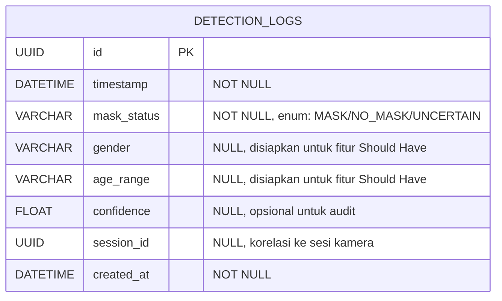

# Entity Relationship Diagram — Sistem Pemantau Kepatuhan Masker

## Diagram

Sesuai lingkup Must Have pada SRS, sistem tidak memerlukan identitas individu atau relasi antar-user — `detection_logs` berdiri sebagai entitas tunggal, tidak punya foreign key ke tabel lain. `session_id` disimpan sebagai referensi longgar (bukan FK relasional formal) ke sesi kamera yang berlangsung sementara di memori, bukan entitas tersimpan permanen.

## Constraint Bisnis

| Field | Constraint |
|---|---|
| `id` | PRIMARY KEY, auto-generated UUID |
| `timestamp` | NOT NULL |
| `mask_status` | NOT NULL, enum terbatas: `MASK`, `NO_MASK`, `UNCERTAIN` |
| `confidence` | Nullable, range 0.0–1.0 bila terisi |
| `gender`, `age_range` | Nullable — kosong sampai fitur Should Have diaktifkan |
| Raw face image | **Tidak ada field ini** — sesuai NFR-05/NFR-06, gambar wajah mentah tidak disimpan permanen |

## Mapping Entitas ↔ Endpoint

| Entitas | Endpoint yang Memakai | Operasi |
|---|---|---|
| `detection_logs` | `POST /api/detection-logs` | Create (simpan hasil klasifikasi valid) |
| `detection_logs` (in-memory, tidak persisten) | `POST /api/detections` | Hasil sementara sebelum diputuskan disimpan sebagai log |
| — (tidak ada entitas kamera tersimpan) | `POST /api/camera-sessions` | Sesi kamera bersifat sementara (in-memory/token), tidak disimpan sebagai tabel database |

[ASUMSI-07] Sesi kamera (`camera-sessions`) tidak memiliki tabel database tersendiri — diasumsikan dikelola sebagai state sementara di aplikasi (in-memory atau cache), karena LLD tidak menyebutkan kebutuhan riwayat sesi kamera sebagai data permanen. [KEPUTUSAN TIM: perlu diverifikasi]
